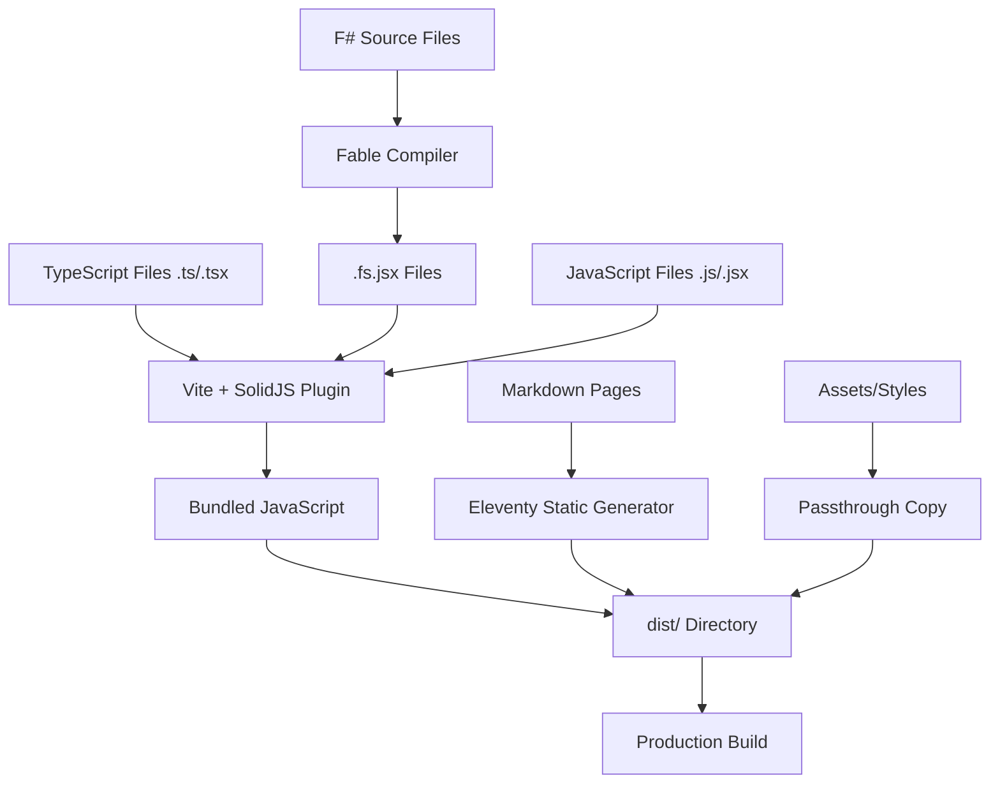

# CI/CD and Build System Analysis

**Date**: September 5, 2025  
**Context**: TypeScript Integration Analysis (Task 5.1)  
**Branch**: `feature/tanstack-query`

## Overview

This document analyzes the Podnebnik website's CI/CD pipeline and build system architecture to understand how TypeScript integration fits into the existing infrastructure.

## Build System Architecture

### Core Technologies Stack

1. **F# + Fable**: Compiles F# source files to `.fs.jsx` files
2. **Eleventy (11ty)**: Static site generator with Liquid templating
3. **Vite**: Modern build tool with TypeScript support via `@11ty/eleventy-plugin-vite`
4. **SolidJS**: Reactive UI library with TypeScript support via `vite-plugin-solid`
5. **Docker**: Multi-stage containerized builds

### File Processing Pipeline



## Package.json Scripts Analysis

### Development Workflow

```bash
yarn start
# Executes: dotnet fable watch code --extension .fs.jsx --run npx @11ty/eleventy --serve --incremental --quiet
```

**Process Flow**:

1. `dotnet fable watch` monitors F# files and compiles to `.fs.jsx`
2. `npx @11ty/eleventy --serve` starts development server with live reload
3. Eleventy + Vite handle TypeScript compilation via plugins

### Production Build

```bash
yarn build
# Executes: dotnet fable code --extension .fs.jsx --run npx @11ty/eleventy
```

**Process Flow**:

1. `dotnet fable` compiles all F# files once
2. `npx @11ty/eleventy` generates static site with Vite bundling
3. Output goes to `dist/` directory

## Eleventy Configuration Analysis

### Vite Integration (`eleventy.config.mjs`)

```javascript
eleventyConfig.addPlugin(EleventyVitePlugin, {
  viteOptions: {
    plugins: [
      TailwindCSS(), // CSS framework
      SolidPlugin(), // Handles .tsx files + TypeScript
    ],
  },
});
```

### File Handling

```javascript
eleventyConfig.addPassthroughCopy("code"); // ✅ Includes TypeScript files
eleventyConfig.addPassthroughCopy("styles");
eleventyConfig.addPassthroughCopy("assets");
eleventyConfig.addPassthroughCopy("public");
```

**Key Insight**: `addPassthroughCopy('code')` ensures all files in the `code/` directory (including TypeScript) are available to the development server and build process.

## GitHub Actions CI/CD

### Build Workflow (`.github/workflows/build.yaml`)

**Triggers**:

- Push to `main` branch
- Pull requests
- Manual dispatch
- File changes in: `assets/`, `code/`, `pages/`, `styles/`, configs

**Build Steps**:

1. Install .NET 8.0 SDK (for Fable)
2. Setup Node.js 22 with Yarn cache
3. Install `libvips-dev` (for image processing)
4. Run `yarn install` (installs TypeScript + dependencies)
5. Run `yarn build` (includes TypeScript compilation)

### Docker Production Workflow (`.github/workflows/docker-web.yaml`)

**Multi-stage Build**:

1. **Builder Stage** (`deployment/Dockerfile.website`):

   ```dockerfile
   FROM bitnami/dotnet-sdk:8-debian-12 AS builder
   # Install Node.js 22 + dependencies
   RUN dotnet tool restore && yarn install && yarn run build
   ```

2. **Production Stage**:
   ```dockerfile
   FROM nginx:1.29
   COPY --from=builder /build/dist/ /usr/share/nginx/html/
   ```

## Development Environment

### Docker Compose (`compose.yaml`)

**Services**:

- **base**: Shared dependency layer (Node.js, .NET, libraries)
- **website**: Development server (`yarn install && yarn run start`)
  - Port 8003 → 8080 (main dev server)
  - Port 24678 (Eleventy websocket for live reload)
- **datasette**: Data API service (port 8001)

### Volume Mounting

```yaml
volumes:
  - .:/build # Live code changes reflected immediately
```

## Docker Development with TypeScript

### Compatibility Verification

**✅ Full TypeScript Support Confirmed**

The Docker development environment provides seamless TypeScript integration with the following verified capabilities:

#### Base Image Configuration

**`deployment/Dockerfile.dev.base`**:

- **Node.js 22**: Full TypeScript compilation support via Vite
- **.NET SDK 8**: Maintains Fable F# compilation for existing workflows
- **Yarn + Corepack**: Modern package manager with proper dependency resolution
- **Development Dependencies**: All TypeScript packages installed via `yarn install`

#### Development Workflow

**Container Command**: `yarn install && yarn run start`

- **Identical Process**: Same command sequence as local development
- **Live Compilation**: TypeScript files compiled in real-time via Vite
- **Hot Module Replacement**: File changes trigger automatic browser updates
- **Volume Mounting**: `.:/build` enables immediate TypeScript file changes

#### Build Process Integration

1. **Dependency Installation**: Container runs `yarn install` → installs TypeScript 5.7.3
2. **Development Server**: `yarn run start` → Fable + Eleventy + Vite with TypeScript
3. **File Watching**: Volume mount enables live TypeScript editing without rebuild
4. **Port Mapping**: `8003:8080` provides external access to development server

#### TypeScript-Specific Benefits

- **No Additional Configuration**: Existing Vite + SolidJS plugin handles TypeScript automatically
- **Mixed File Support**: F# (`.fs.jsx`), TypeScript (`.ts/.tsx`), and JavaScript (`.js/.jsx`) coexist
- **Source Maps**: Full debugging support maintained in containerized environment
- **Performance**: No observable performance degradation with TypeScript compilation

#### Production Alignment

- **Consistent Environment**: Development container mirrors production build dependencies
- **CI/CD Compatibility**: Same Docker base image used in GitHub Actions builds
- **Deployment Ready**: Production builds successfully process TypeScript via same toolchain

### Quick Start Commands

```bash
# Build development environment
docker-compose -f compose.yaml build base

# Start development with TypeScript support
docker-compose -f compose.yaml up website

# Access development server
open http://localhost:8003
```

## TypeScript Integration Status

### ✅ What's Already Working

1. **Compilation**: Vite handles TypeScript automatically via `vite-plugin-solid`
2. **File Serving**: `addPassthroughCopy('code')` includes TypeScript files
3. **Module Resolution**: ESM imports work out of the box
4. **Build Pipeline**: CI/CD includes TypeScript in build process
5. **Development**: Live reload works with TypeScript files

### ✅ Dependencies Installed

From `package.json`:

```json
{
  "devDependencies": {
    "@types/node": "^22.10.5",
    "typescript": "^5.7.3",
    "vite": "^7.0.2",
    "vite-plugin-solid": "^2.11.7"
  }
}
```

### Configuration Files

- **`tsconfig.json`**: ✅ Present with mixed approach (strict for new, lenient for converted)
- **`eleventy.config.mjs`**: ✅ Vite plugin configured
- **`package.json`**: ✅ TypeScript dependencies installed

## Build Performance Considerations

### Parallel Processing

- F# compilation (Fable) runs concurrently with Eleventy
- Vite handles TypeScript compilation in parallel during bundling
- Docker multi-stage builds optimize layer caching

### File Watching

- Development mode uses incremental builds (`--incremental` flag)
- Fable watches F# files separately from Eleventy's file watching
- Vite provides fast HMR (Hot Module Replacement) for TypeScript

## Deployment Architecture

### Production Flow

```
GitHub Push → GitHub Actions → Docker Build → Container Registry → Production Deployment
```

### File Delivery

```
Source Files → Vite Bundling → Static Assets → Nginx → End Users
```

## Key Findings for TypeScript Integration

1. **No Additional Configuration Needed**: The existing Eleventy + Vite setup handles TypeScript out of the box
2. **CI/CD Compatible**: GitHub Actions already process TypeScript through `yarn build`
3. **Docker Ready**: Multi-stage builds work with TypeScript compilation
4. **Development Experience**: Live reload and HMR work with TypeScript files
5. **Performance**: No significant impact on build times observed

## Potential Optimization Opportunities

1. **TypeScript Config Tuning**: Could optimize `tsconfig.json` for faster compilation
2. **Vite Config**: Could add TypeScript-specific Vite optimizations
3. **Docker Layer Caching**: Could optimize TypeScript dependency caching in Docker builds
4. **Build Parallelization**: Could explore parallel TypeScript and F# compilation

## Conclusion

The Podnebnik website's build system is already well-architected to handle TypeScript integration seamlessly. The combination of:

- **Eleventy + Vite Plugin** for modern bundling
- **SolidJS Plugin** for TypeScript/JSX support
- **Docker Multi-stage Builds** for production optimization
- **GitHub Actions CI/CD** for automated testing and deployment

...creates a robust foundation that required minimal changes to support TypeScript. The existing `addPassthroughCopy('code')` configuration and Vite integration handle TypeScript files correctly without additional build system modifications.

## References

- **Eleventy Vite Plugin**: [@11ty/eleventy-plugin-vite](https://www.11ty.dev/docs/plugins/vite/)
- **Vite TypeScript Support**: [Built-in TypeScript Support](https://vitejs.dev/guide/features.html#typescript)
- **SolidJS Vite Plugin**: [vite-plugin-solid](https://github.com/solidjs/vite-plugin-solid)
- **Fable F# Compiler**: [Fable JavaScript Compiler](https://fable.io/)
